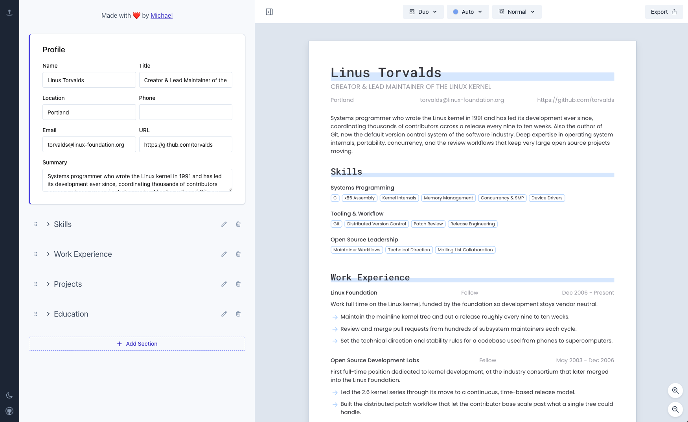

# Developer Resume Builder

A free and open source resume builder made for developers. Fill in a form on the
left, watch a real PDF render on the right, and export when it looks right.

Data is stored in your browser's `localStorage` — there is no backend. Resumes
follow the [JSON Resume](https://jsonresume.org/) schema, so they can be
imported and exported as standard JSON.

**[Demo →](https://michaelmov.github.io/resume-builder/)**



## Features

- Live PDF preview
- Multiple templates, accent colors, and page-margin presets
- Every JSON Resume section — add, reorder, and rename
- Auto-save, no Save button
- Export as PDF, JSON Resume, or ATS-friendly plain text
- Import any JSON Resume file

## Local development

Node `20.19.0` is pinned in `.nvmrc`.

```bash
npm install
npm run dev        # Vite dev server, opens a browser
```

Other useful scripts:

```bash
npm run build      # tsc typecheck + production build → dist/
npm run preview    # serve the production build locally
npm run lint       # ESLint (lint:fix to autofix)
npm run format     # Prettier
npm run test       # Vitest
npm run deploy     # build + publish dist/ to GitHub Pages
```

A pre-commit hook runs `npm run lint && npm test`, and CI runs both on every
push and pull request.

## Built with

React 18 · TypeScript · Vite · Chakra UI v3 · react-hook-form ·
`@react-pdf/renderer` · `@dnd-kit` · zod · Vitest

Contributions are welcome — open an issue or a pull request.
